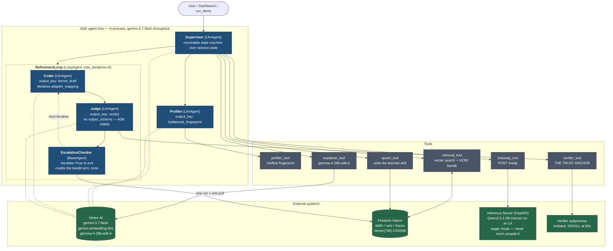
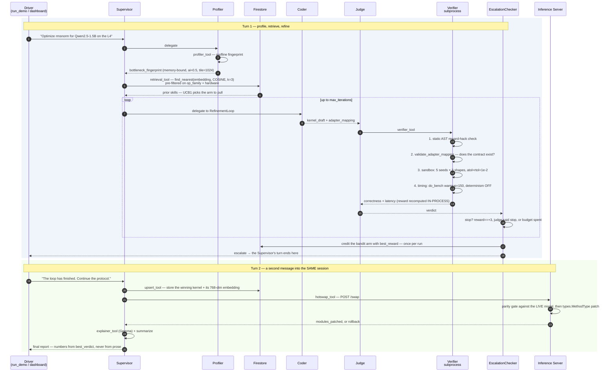
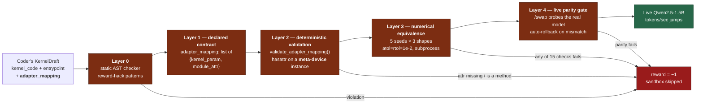
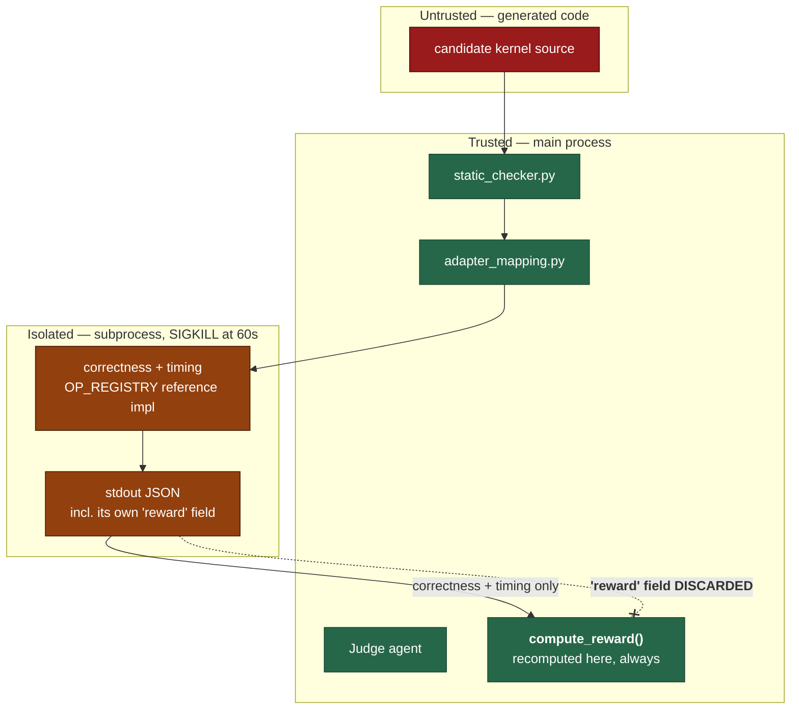

# KernelSmith — Architecture

An in-process Google ADK agent tree that generates, verifies, and hot-swaps Triton GPU
kernels into a live Qwen2.5-1.5B inference server.

The claim this system makes is narrow and checkable: **the agent writes the deployment
contract, and a deterministic verifier decides whether it is true.** Everything below
exists to keep that sentence honest.

---

## The tree



---

## The run, end to end



---

## Why the shape is what it is

### Two turns, not one

`LoopAgent` cannot transfer back to its parent, so the Supervisor's turn ends the moment
the RefinementLoop escalates — with the kernel scored but neither saved nor swapped.
Steps 4–7 run on a **follow-up message into the same session**. Both drivers
(`run_demo` and the dashboard's `drive_run()`) send it automatically. Anything that
sends only one message silently skips the hot-swap and reports a run that never went
live.

### The EscalationChecker is a `BaseAgent`, never a tool or callback

Setting `actions.escalate` from inside a tool or callback is broken in ADK (#501,
#2692, #2808, #2988): it either fails to terminate the loop, throws OpenTelemetry
context errors, or escalates every enclosing loop at once. A dedicated sub-agent that
yields one `Event` carrying `actions.escalate` is the documented pattern.

It is also the only point in the tree that knows a run is **over**, which is why the
bandit credit lives there: `best_reward` is only final at escalation, and one run is one
pull. Crediting per iteration would log six pulls for one experiment; crediting from the
Supervisor's upsert step would skip every run that scored below +1, biasing every arm's
mean upward.

### Only one `LoopAgent` level

Nested loop escalation escapes all enclosing loops at once (#2692). The Supervisor is
therefore an `LlmAgent`, deliberately, not an outer loop.

### The Judge has no `output_schema`

An agent with both `output_schema` and tools is fragile in ADK (#3969), and the Judge
needs `verifier_tool`. It emits JSON as text and an `after_agent_callback` parses it into
the `Verdict` model. Until that callback lands, `verdict` in state is raw model text —
which is exactly why `EscalationChecker` treats a non-dict verdict as "keep looping"
rather than as a decision.

---

## The three-layer safety model

The novel contribution is layers 1 and 2: **the agent generates the deployment contract,
and the verifier validates it deterministically.** Published systems (HF `kernels`,
FlashInfer-Bench, Kernel Contracts) all use human-authored deployment bridges.



`adapter_mapping` maps kernel parameter names to module attribute names. The Coder
declares it as a **list of named-field objects**, one per wrapper parameter after the
input tensor:

```json
[{"kernel_param": "weight", "module_attr": "weight"},
 {"kernel_param": "eps",    "module_attr": "variance_epsilon"}]
```

The list shape is load-bearing, not stylistic. As a `dict[str, str]` the field compiles
to a JSON schema with no named properties, and structured generation filled it **0 times
out of 3**, emitting `{}` — which is not an error anywhere downstream, it just falls
back to the hard-coded adapter. As a list of two-field objects it filled 3/3. For the
same reason the Judge never passes the contract as a tool argument: `verify_kernel`
reads it from the draft in session state, so the model cannot restate, invent, or drop
it.

The forward input argument (`x`, `hidden_states`) is implicit and mapping it is an
error, not a no-op.

Validation cannot use `hasattr(Qwen2RMSNorm, "weight")` — that is `False`, because
`weight` and `variance_epsilon` are assigned in `__init__` and exist on instances, not
on the class. So `validate_adapter_mapping` builds a real instance under
`torch.device("meta")` (zero bytes, no GPU) and probes *that*. Ops with no `nn.Module`
in Qwen2 (`rope`, `softmax`, `silu`, `layernorm`) reject any non-empty mapping: an
unvalidatable contract is also an undeployable one.

Per-op hard-coded adapters remain as the fallback when `adapter_mapping` is absent, for
the seed kernels.

---

## The trust boundary



Two rules hold this together:

1. **The subprocess's own `reward` is discarded.** The candidate controls that stdout;
   trusting its self-reported score is a trust-boundary violation. Reward is always
   recomputed in-process from the correctness and timing results.
2. **The task spec never carries executable Python.** `verify_kernel` resolves
   `op_name` through `OP_REGISTRY` to get the reference implementation. A task spec
   carrying source would be a second, unchecked path into the sandbox.

---

## Honest measurement

Two settings decide whether the reported speedup is real.

**`do_bench(warmup=150, rep=200, return_mode="median")`.** Triton's documented default
of `warmup=25` underestimates latency by ~30% (Triton #2306). `bench_kernel()` raises
if `warmup < 150` rather than trusting callers.

**Determinism off for the timed baselines only.**
`torch.use_deterministic_algorithms(True)` forces slower cuBLAS/cuDNN codepaths and
costs the eager and torch.compile baselines ~23% — while leaving a Triton candidate
untouched, because Triton generates its own PTX and never consults the flag. Timing the
baselines under it manufactures a speedup out of a measurement artifact:

| | vs eager | vs torch.compile |
|---|---|---|
| Deterministic flag ON (inflated) | 8.52× | — |
| **Deterministic flag OFF (fair, reported)** | **6.92×** | **1.36×** |

`measure_baselines()` turns the flag off around the timed region and restores it —
`warn_only` included — even if benchmarking raises. It stays ON everywhere else:
correctness checks, the agent loop, the demo.

**The model is never `torch.compile`'d.** `torch.compile` bakes the current `forward`
into a compiled graph, and a later `types.MethodType` patch silently no-ops — the graph
keeps running the old forward and the swap fakes a speedup. The served model stays in
eager mode. The only `torch.compile` in the system is inside `measure_baselines()`,
where the compiled baseline is measured and then discarded.

---

## Memory and the bandit

`skills` is a Firestore Native collection with a **composite** vector index: equality
pre-filters on `op_family` and `hardware` precede the `Vector(768)` COSINE field.
Firestore vector search supports equality pre-filters only — no inequalities — and the
pre-filter fields must come first in the index.

Retrieval is keyed on the **bottleneck fingerprint**, not the op name, which is what
makes cross-op transfer possible: a kernel learned on RMSNorm surfaces for a different
op with the same boundedness and tile shape. The transferable part is the `fix_rule`;
the kernel source is a starting point, never used verbatim.

A UCB1 bandit over the retrieved rows picks one arm per run. Embeddings are
`gemini-embedding-001` truncated to 768 dims (MRL), asserted and L2-normalized after
every call.

---

## Reproducibility

`seed_everything()` runs before anything imports torch, in this order and for this
reason:

1. `CUBLAS_WORKSPACE_CONFIG=:4096:8` **first** — cuBLAS reads it when its handle is
   created and ignores it afterwards, at which point
   `use_deterministic_algorithms(True)` throws on the first GEMM.
2. Python / NumPy / torch CPU + all CUDA device seeds.
3. `set_float32_matmul_precision("high")` — TF32 on, so the eager baseline is the
   KernelBench-Verified one. An un-TF32'd eager baseline hands us a free ~2× on any
   matmul.
4. `use_deterministic_algorithms(True)` last.

This file exists because of the field's credibility problem, not in spite of it:
Sakana's 3.13× became 1.49×, and KernelBench-Verified's 1.43× became 0.88×, once anyone
re-ran them. Both collapses were seeding and baseline artifacts.

---

## Testing

| Layer | Command | Scope |
|---|---|---|
| Unit | `make test-unit` | Hermetic. No GPU, no network. 317 tests. |
| Integration | `make test-int` | Live gemini-3.7-flash + Firestore + GPU, `max_iterations=2`. |
| All | `make test` | Both. |

`tests/test_integration.py` drives profile → retrieve → refine **once**, in a
module-scoped fixture, and every assertion reads that one result — rerunning the
pipeline per test function would multiply token spend for no extra coverage. Its pass
bar is `reward >= -1`: a two-iteration budget against a nondeterministic model can
legitimately fail to produce a winning kernel, and a test demanding `reward >= 3` would
fail on model variance rather than on a defect. What must hold every time is that the
pipeline completes and the verifier **scores** the attempt. The assertions that only
hold for a winner are reward-conditional.

It skips itself, rather than failing, without a CUDA device or Google credentials.
